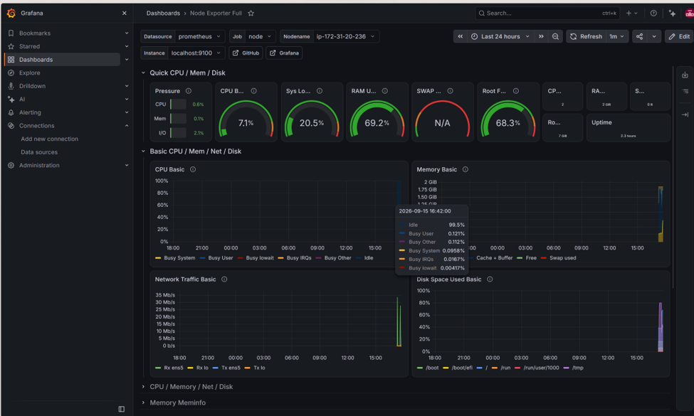

# AWS EC2 Nginx & System Observability Pipeline

<div align="center">
  
  
  
  
</div>

An end-to-end monitoring and observability pipeline deployed on AWS EC2 to collect, scrape, and visualize real-time OS metrics and HTTP performance using Prometheus, Node Exporter, Nginx Exporter, and Grafana.

This setup also includes simulated traffic and hardware stress tests to validate live metric behavior under load.

---

## Overview

The project demonstrates a production-style observability stack where:

- Prometheus scrapes system and application metrics
- Node Exporter exposes OS and hardware telemetry
- Nginx Exporter exposes HTTP and connection metrics
- Grafana visualizes trends and dashboards in real time

---

## Screenshots

These screenshots are stored in the repository and are ready to render on GitHub.

### Nginx Metrics


### System Information



> GitHub supports relative image paths in Markdown, and the files above are already included in the repo.

---

## Architecture


```text
┌──────────────────────────────────────────────────────────┐
│                     AWS EC2 Instance                     │
│                                                          │
│  Linux Host ─────► Node Exporter (:9100) ─────► Prometheus │
│                                                          │
│  Nginx (:80) ─────► Nginx Exporter (:9113) ───► Prometheus │
│                                                          │
│  Prometheus (:9090) ─────► Grafana (:3000) ─────► Dashboards │
└──────────────────────────────────────────────────────────┘
```

---

## Key Features

- System metrics: CPU, RAM, disk I/O, network traffic, and Linux PSI
- Application metrics: active TCP connections and HTTP status activity
- Background services managed with systemd and automatic restarts
- Synthetic load validation using Apache Bench and stress tooling
- Live dashboards for operational visibility and troubleshooting

---

## Tech Stack and Port Matrix

| Component | Role | Endpoint / Port |
| --- | --- | --- |
| Nginx | Web server and status endpoint | 80 / 8080 |
| Node Exporter | OS and hardware metrics | 9100 |
| Nginx Exporter | Nginx HTTP metrics | 9113 |
| Prometheus | Time-series collection and storage | 9090 |
| Grafana | Visualization and dashboarding | 3000 |

---

## Deployment and Installation

### 1) Configure Nginx status endpoint

Install Nginx and enable the local status page:

```bash
sudo apt update && sudo apt install nginx -y
sudo systemctl enable --now nginx
```

Create a status config:

```bash
sudo nano /etc/nginx/conf.d/stub_status.conf
```

Add:

```nginx
server {
    listen 127.0.0.1:8080;

    location /nginx_status {
        stub_status;
        allow 127.0.0.1;
        deny all;
    }
}
```

Reload Nginx:

```bash
sudo nginx -t && sudo systemctl reload nginx
```

### 2) Install exporters as systemd services

#### Node Exporter

```bash
cd /tmp
wget https://github.com/prometheus/node_exporter/releases/download/v1.10.2/node_exporter-1.10.2.linux-amd64.tar.gz
tar xvf node_exporter-1.10.2.linux-amd64.tar.gz
sudo mv node_exporter-1.10.2.linux-amd64/node_exporter /usr/local/bin/
```

Create `/etc/systemd/system/node_exporter.service`:

```ini
[Unit]
Description=Node Exporter

[Service]
User=nobody
ExecStart=/usr/local/bin/node_exporter
Restart=always

[Install]
WantedBy=multi-user.target
```

#### Nginx Exporter

```bash
cd /tmp
wget https://github.com/nginxinc/nginx-prometheus-exporter/releases/download/v1.3.0/nginx-prometheus-exporter_1.3.0_linux_amd64.tar.gz
tar xvf nginx-prometheus-exporter_1.3.0_linux_amd64.tar.gz
sudo mv nginx-prometheus-exporter /usr/local/bin/
```

Create `/etc/systemd/system/nginx_exporter.service`:

```ini
[Unit]
Description=Nginx Exporter

[Service]
User=nobody
ExecStart=/usr/local/bin/nginx-prometheus-exporter --nginx.scrape-uri=http://127.0.0.1:8080/nginx_status
Restart=always

[Install]
WantedBy=multi-user.target
```

Start both services:

```bash
sudo systemctl daemon-reload
sudo systemctl enable --now node_exporter nginx_exporter
```

### 3) Install and configure Prometheus

```bash
cd /tmp
wget https://github.com/prometheus/prometheus/releases/download/v2.53.0/prometheus-2.53.0.linux-amd64.tar.gz
tar xvf prometheus-2.53.0.linux-amd64.tar.gz
sudo mv prometheus-2.53.0.linux-amd64/prometheus /usr/local/bin/
sudo mv prometheus-2.53.0.linux-amd64/promtool /usr/local/bin/

sudo mkdir -p /etc/prometheus /var/lib/prometheus
sudo chown -R nobody:nogroup /var/lib/prometheus
```

Create `/etc/prometheus/prometheus.yml`:

```yaml
global:
  scrape_interval: 15s

scrape_configs:
  - job_name: 'prometheus'
    static_configs:
      - targets: ['localhost:9090']

  - job_name: 'node'
    static_configs:
      - targets: ['localhost:9100']

  - job_name: 'nginx'
    static_configs:
      - targets: ['localhost:9113']
```

Create `/etc/systemd/system/prometheus.service`:

```ini
[Unit]
Description=Prometheus

[Service]
User=nobody
ExecStart=/usr/local/bin/prometheus --config.file=/etc/prometheus/prometheus.yml --storage.tsdb.path=/var/lib/prometheus
Restart=always

[Install]
WantedBy=multi-user.target
```

Enable and start Prometheus:

```bash
sudo systemctl daemon-reload
sudo systemctl enable --now prometheus
```

### 4) Install Grafana and connect Prometheus

```bash
sudo apt install -y apt-transport-https software-properties-common
wget -q -O - https://packages.grafana.com/gpg.key | sudo apt-key add -
echo "deb https://packages.grafana.com/oss/deb stable main" | sudo tee /etc/apt/sources.list.d/grafana.list
sudo apt update && sudo apt install grafana -y
sudo systemctl enable --now grafana-server
```

Open:

```text
http://<EC2-PUBLIC-IP>:3000
```

Default login:

```text
Username: admin
Password: admin
```

Then:

1. Add Prometheus as a data source
2. Set the URL to `http://localhost:9090`
3. Import the following community dashboards:
   - Node Exporter Full: `1860`
   - Nginx Exporter: `12708`

---

## Load Testing and Verification

### HTTP traffic simulation

```bash
sudo apt install apache2-utils -y

# Send continuous requests with 20 concurrent connections over 5 minutes
ab -n 1000000 -t 300 -c 20 http://localhost/
```

This produces measurable request spikes in Grafana and validates connection processing in the Nginx dashboard.

### CPU stress testing

```bash
sudo apt install stress -y

# Stress 2 CPU cores for 60 seconds
stress --cpu 2 --timeout 60s
```

This pushes the system under load and should visibly increase CPU utilization in the Node Exporter dashboard.

---

## Key Learnings and Troubleshooting

- Prometheus is for numeric time-series metrics, while logs are better handled with tools such as Loki and Promtail.
- Using `http://localhost:9090` inside Grafana avoids issues caused by changing EC2 public IP addresses.
- PromQL queries should use standardized instance labels to prevent dashboard variable mismatches.

---

## Project Structure

```text
prometheus-grafana/
├── README.md
├── configs/
│   └── prometheus.yml
├── dashboards/
│   ├── NGINX exporter.json
│   └── Node exporter.json
└── .gitignore (optional)
```

---

## Result

This stack gives you a clear, real-time view of:

- server health and hardware pressure
- application throughput and request volume
- resource bottlenecks under load
- a strong foundation for production monitoring workflows

If you want, I can also turn this into a more polished GitHub landing page style README with screenshots, badges, and a cleaner deployment checklist for export.